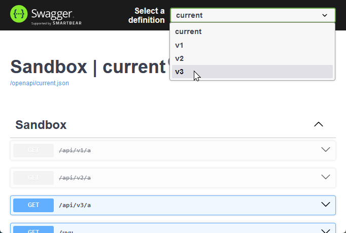

# Route Versioning

An attempt at implementing route-based API versioning for ASP.NET Core. This library works by
exhaustively mapping all corresponding API versions, on startup. Only minimal APIs are currently
supported.

> [!WARNING]
>
> **Still a work in progress!!** The examples below will likely change as I finalise its APIs. My
> to-do list is:
>
> - [x] Minimal APIs
> - [x] OpenAPI
> - [x] Sunset header
> - [ ] Tests
> - [ ] Controllers, if possible?
> - [ ] Target lower .NET versions?
> - [ ] NuGet package

> [!TIP]
>
> If you're looking for a library that supports other versioning schemes (query parameters, request
> headers, content negotiation, etc.), consider
> [`Asp.Versioning`](https://github.com/dotnet/aspnet-api-versioning) which is more versatile, and
> should be capable of everything that this library offers with some configuration.
>
> Comparatively, this library,
>
> - Offers just one API versioning scheme (route-based).
> - Maps all versions at startup, instead of (as I understand) resolving API versions as requests
>   come through.
> - Uses API version _ranges_ (i.e., vX-onward/between vX & Y inclusive) by default.

## Usage

### Mapping a Versioned API

1. Define all available API versions with a `RouteVersionSetBuilder`.

   ```csharp
   // In this case, the API has 3 versions.
   var versions = new RouteVersionSetBuilder<int>()
   	.Version(1)
   	.Version(2)
   	.Version(3)
   	.Build();
   ```

2. Use `WithVersions` to map versioned endpoints, specifying the range of versions to which they
   apply.

   ```csharp
   var api = app.MapGroup("api").WithVersions(versions);
   ```

   - Use `From` to map an endpoint that is available _from a specific version onward_.

     ```csharp
     // api/v1/a (introduced)
     // api/v2/a (unchanged)
     // api/v3/a (unchanged)
     api.From(1).MapGet("a", () => ...);

     // api/v2/b (introduced)
     // api/v3/b (unchanged)
     api.From(2).MapGet("b", () => ...);

     // api/v3/c (introduced)
     api.From(3).MapGet("c", () => ...);
     ```

   - Use `Between` to map an endpoint that is available _in all versions within an inclusive range_
     of versions.

     ```csharp
     // api/v1/d (introduced)
     // api/v2/d (unchanged; retired)
     api.Between(1, 2).MapGet("d", () => ...);
     ```

   - Combine the two to _revise an endpoint_ at a specific version.

     ```csharp
     // api/v1/e (introduced)
     // api/v2/e (unchanged)
     api.Between(1, 2).MapGet("e", () => ...);

     // api/v3/e (revised)
     api.From(3).MapGet("e", () => ...);
     ```

### Adding Endpoint Conventions

- To add a convention that applies to _a specific endpoint across a range of API versions_ (`v*/a`),
  add a convention as you normally would, after the `Map*` call.

  ```csharp
  api.Between(1, 2).MapGet("a", () => ...).AddEndpointFilter<UwuifyFilter>();
  api.From(3).MapGet("a", () => ...).AddEndpointFilter<UwuifyFilter>();
  ```

- To add a convention that applies to _all endpoints of a specific API version_ (`v1/*`), use the
  configuration delegate of `RouteVersionSetBuilder.Version`.

  ```csharp
  var versions = new RouteVersionSetBuilder<int>()
   	.Version(1, (v) => v
  		.AddEndpointFilter<IEndpointConventionBuilder, UwuifyFilter>()
  	)
   	.Build();
  ```

### Generating OpenAPI Documents

- The default
  [`Microsoft.AspNetCore.OpenApi`](https://www.nuget.org/packages/Microsoft.AspNetCore.OpenApi)
  document includes all versioned APIs.

  ```csharp
  services.AddOpenApi("current");
  app.MapOpenApi();

  // openapi/current.json includes:
  //     api/v1/{a,d,e}
  //     api/v2/{a,b,d,e}
  //     api/v3/{a,b,c,e}
  ```

  To exclude versioned operations from this document, use `ExcludeVersionedOperations()`.

  ```csharp
  services.AddOpenApi("current", (options) => options
  	.ExcludeVersionedOperations()
  );
  ```

- Use `AddVersionedOpenApi` to add version-specific OpenAPI documents using `AddVersionedOpenApi`.
  To exclude unversioned endpoints from these documents, specify
  `includeUnversionedEndpoints: false`.

  ```csharp
  services.AddVersionedOpenApi(versions, includeUnversionedEndpoints: false);

  // openapi/v1.json includes api/v1/{a,d,e}
  // openapi/v2.json includes api/v2/{a,b,d,e}
  // openapi/v3.json includes api/v3/{a,b,c,e}
  ```

  Use the configuration delegate of `RouteVersionSetBuilder.Version` to configure version-specific
  OpenAPI options.

  ```csharp
  new RouteVersionSetBuilder<int>().Version(1, (v) => v
  	.ConfigureOpenApiInfo((i) => i.Description = "v1 description")
  	.ConfigureOpenApiOptions(...)
  );
  ```

### Configuring OpenAPI UIs

- [`Scalar.AspNetCore`](https://www.nuget.org/packages/Scalar.AspNetCore) uses the OpenAPI document
  specified in the path.

  ```csharp
  // scalar/current
  // scalar/v1
  // scalar/v2
  // scalar/v3
  app.MapScalarApiReference();
  ```

- [Swagger UI](https://github.com/swagger-api/swagger-ui) can be configured with URLs of all
  generated OpenAPI documents.

  ```csharp
  app.MapGet("swagger", () =>
  {
  	var urls = new[] { "current" }
  		.Concat(versions.Select(versions.GetSlug))
  		.Select((name) => new { name, url = $"/openapi/{name}.json" });

  	return Results.Content(contentType: "text/html", content: $$"""
  		<!DOCTYPE html>
  		<html>
  		<head>
  			<meta name="viewport" content="width=device-width, initial-scale=1" />
  			<style>body { margin: 0 }</style>
  			<link rel="stylesheet" href="https://cdn.jsdelivr.net/npm/swagger-ui-dist@5.18.2/swagger-ui.css" />
  		</head>
  		<body>
  			<div id="swagger-ui"></div>
  			<script src="https://cdn.jsdelivr.net/npm/swagger-ui-dist@5.18.2/swagger-ui-bundle.js"></script>
  			<script src="https://cdn.jsdelivr.net/npm/swagger-ui-dist@5.18.2/swagger-ui-standalone-preset.js"></script>
  			<script>
  				SwaggerUIBundle({
  					urls: {{JsonSerializer.Serialize(urls)}},
  					dom_id: '#swagger-ui',
  					presets: [
  						SwaggerUIBundle.presets.apis,
  						SwaggerUIStandalonePreset,
  					],
  					layout: 'StandaloneLayout',
  				});
  			</script>
  		</body>
  		</html>
  		"""
  	);
  })
  ```

  

### Retiring an API Version

- Use `Sunset` to indicate an API version being retired, which adds the specified details as
  `Sunset` and `Link` headers as described in
  [RFC 8594](https://datatracker.ietf.org/doc/html/rfc8594), to its responses.

  ```csharp
  var versions = new RouteVersionSetBuilder<int>()
  	.Version(1, (v) => v
  			.Sunset(
  				at: someDateTime,
  				link: "https://example.com/changelog/v2-migration",
  				linkMediaType: "text/html"
  			)
    	)
     	.Build();
  ```

  ```http
  HTTP/1.1 200 OK
  Sunset: Tue, 24 Dec 2024 12:41:24 GMT
  Link: <https://example.com/changelog/v2-migration>; rel="sunset"; type="text/html"
  ```

- Operations of retired API versions will be marked deprecated in
  [version-specific OpenAPI documents](#generating-openapi-documents).

  To do the same in other OpenAPI documents, use `MarkSunsettedOperations()`.

  ```csharp
  services.AddOpenApi("current", (options) => options
  	.MarkSunsettedOperations()
  );
  ```
